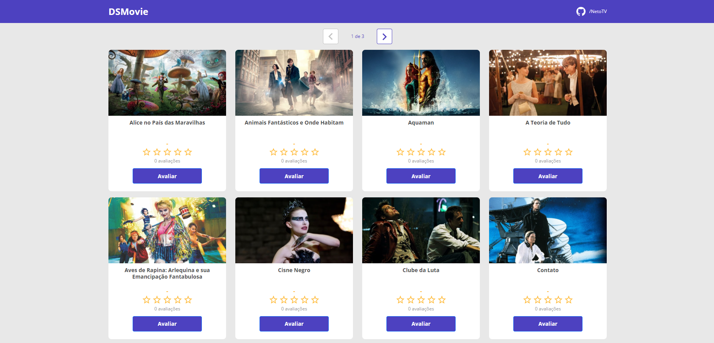

<h1 align="center">
   DSMovie
</h1>

 

## :camera: Demonstração

## :rocket: Tecnologias

Esse projeto foi desenvolvido com as seguintes tecnologias:

✔️HTML5 & CSS3

✔️Bootstrap

✔️TypeScript

✔️Spring & STS

✔️JDK 17 (Java)

✔️Postgresql 12 e pgAdmin

✔️Heroku CLI

✔️Git

## 💻 Projeto

Este projeto foi desenvolvido durante à [Semana Spring React](https://github.com/devsuperior/sds-dsmovie) realizada pela escola de programação [DevSuperior](https://devsuperior.com.br)

## ⚙ Acesso ao site

[Clique aqui para acessar o site!](https://dsmovie-plb.netlify.app)
